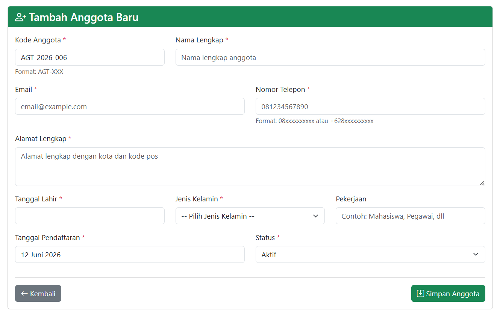
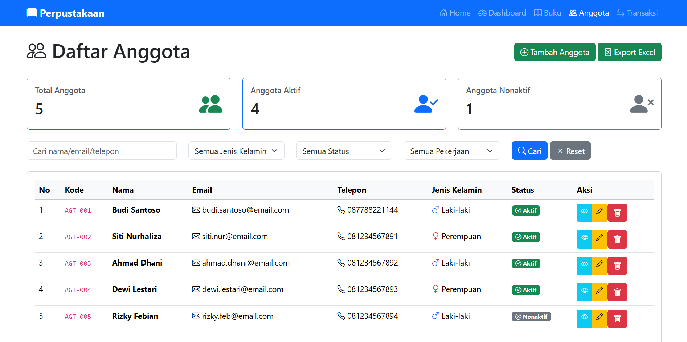
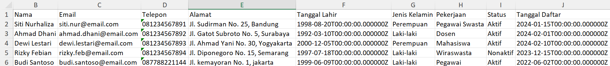
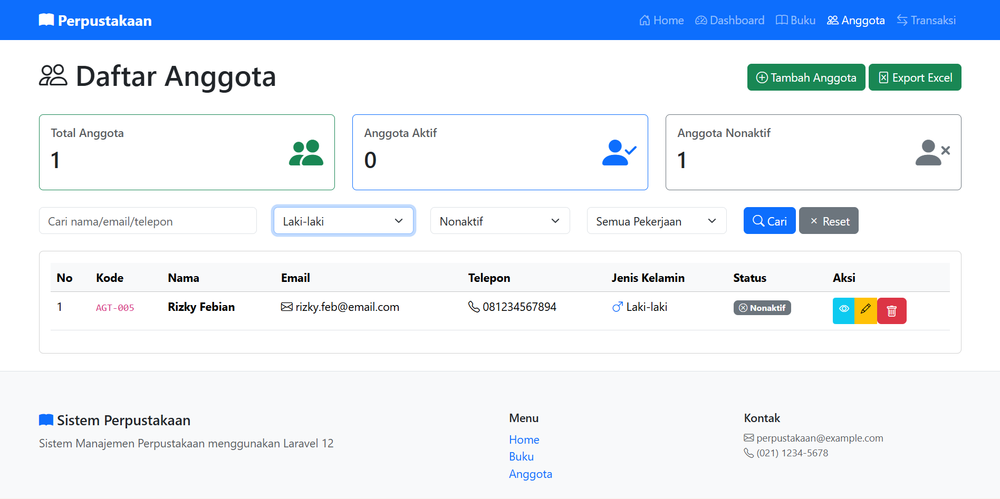

# CRUD-Anggota-dengan-Laravel
Belajar menerapkan DRY principle, refactoring code, dan membuat validasi yang lebih advanced untuk data personal seperti email, telepon, dan tanggal lahir. DRY (Don't Repeat Yourself) adalah prinsip pemrograman yang menekankan untuk menghindari duplikasi code. Setiap logic harus memiliki single, unambiguous representation dalam sistem.

## Tugas Pertemuan 13

**Nama:** Bima Adi Nugroho  
**NIM:** 60324077  

---

## Tugas 1: Auto-Generate Kode Anggota

Implementasi fitur auto-generate kode anggota dengan format:

```text
AGT-[TAHUN]-[NOMOR_URUT]
```

### Generate Kode Anggota



---

## Tugas 2: Export Anggota ke Excel

Implementasikan fitur export data anggota ke file Excel menggunakan package Laravel Excel (maatwebsite/excel) versi terbaru.

### Tampilan Export Excel pada Index



---

### Tampilan Data Hasil Export ke Excel



---

## Tugas 3: Advanced Search & Filter

Tambahkan fitur search dan filter advanced untuk anggota.

### Search & Filter Anggota



---
